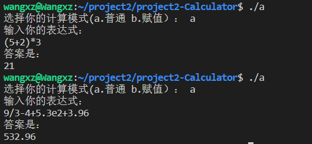
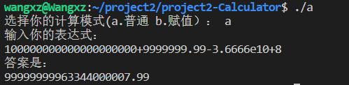
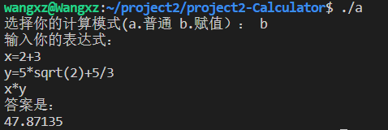
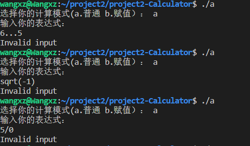

# CS205 C/ C++ Programming - Project2

<font size=3>**Name:** 王习之（Wang Xizhi）

**SID:** 11911818</font>

## Part1 - Analysis

---
因为在project1中我已经完成了高精度且可完成大数运算的乘法器，在此基础上，我在第二个project中完成了更多功能的计算器，可以实现普通的运算以及赋值运算。为了运算时间更快，我设置了运算数字总共可以到20个，同时为了实现能够科学计数法的数字运算，我建立了一个structure结构体来储存每一个数字的详细信息，包括小数点的位置，数字的正负等等。

```c++
struct Database
{
    long long point;
    string a1;
    int sign, ae;
};
```

整个改进的运算器我预计实现的算法有加法，减法，乘法，除法，开方以及平方多次方的计算，同时也实现了赋值计算，数字的范围从高精度的整数到小数，再到科学计数法都可以实现。

在进行普通运算时，会出现乘除法的优先级，以及括号的更高级，所以我考虑使用了逆波兰表达式。在平时我们更习惯于使用中缀表达式，例如`(2+3)*5`这样的，但是这在计算机语言中是很麻烦的，所以我考虑将其转为后缀表达式，也是逆波兰表达式的一种，可以转为`2 3 + 5 *`这样就可以让计算机明白我们表达式的计算顺序。而要转化为逆波兰表达式，我则需要用到栈`stack`。栈遵循先进后出的原则，所以当输入数字的时候，数字保留在计算的栈中，而判断为运算符号时，就可以进行相应的运算。

同时，我实现了更多功能，有开方以及指数运算，这是我们的表达式中会出现`sqrt(2)`或者`(3)^3`这样的表示式子。和第一次project相同，我也使用了正则表达式，去判断，提取了相应的字符，同时先运算了括号中的内容，将结果替换原字符串相应的内容，再转化为逆波兰表达式。

正则表示式则是在我的整个代码中都多次使用，判断数字是否为规范的数字，分解数字的各个信息，判断是否为开放或者指数运算都是必要的。

在判断是赋值操作时，为了整个操作系统更加的直观和智能，我在开头可以让用户选择当前的模式，如下，

```
选择你的计算模式(a.普通 b.赋值）： 
输入你的表达式：
```

这样当出现例如`x=2`的赋值操作时，我也新建了一个结构体来储存相应符号对应的数字

```
struct Fuzhi
{
    string symbol, number;
};
```

当出现运算表达式的时候，我会将符号转为相应的数字，再进行逆波兰表达式的转换。

## Part2 - Code

---
这是我的`mai.cpp`文件

```c++
#include <iostream>
#include <string>
#include <regex>
#include <sstream>
#include <math.h>
#include "main.hpp"

using namespace std;
string asd;

int main()
{
    cout << "选择你的计算模式(a.普通 b.赋值）： ";
    string choose;
    getline(cin, choose);
    cout << "输入你的表达式： " << endl;
    if (choose == "a")
    {
        string input;
        getline(cin, input);
        input = transToRPN(input);

        asd = cal(input);
    }
    if (choose == "b")
    {
        string input;
        Fuzhi fuzhi[20];
        int count = 1;
        for (int i = 0; i < count; i++)
        {
            getline(cin, input);
            input = judgefuzhi(input, count, fuzhi);
            if (input != "w")
            {
                input = transToRPN(input);
                asd = cal(input);

                break;
            }
            count++;
        }
    }
    cout << "答案是： " << endl;
    cout << asd << endl;

    return 0;
}
```

下面是加法的文件，加减乘除法都可以在github中找到。

```
#include <iostream>
#include <string>
#include <regex>
#include <sstream>
#include <math.h>
#include "../main.hpp"

using namespace std;

string add(string aa, string bb, Database database[], int signtran)
{
    long long number1, number2, pointt, dis, sign1, sign2;
    string num1, num2;
    int aaa = stoi(aa);
    int bbb = stoi(bb);
    number1 = database[aaa].ae - database[aaa].point;
    number2 = database[bbb].ae - database[bbb].point;
    num1 = database[aaa].a1;
    num2 = database[bbb].a1;
    sign1 = database[aaa].sign;
    sign2 = database[bbb].sign;
    if (sign1 == 1 && sign2 == 0)
    {
        database[aaa].sign = 0;
        return min(bb, aa, database, 0);
    }
    if (sign1 == 1 && sign2 == 1)
    {
        database[aaa].sign = 0;
        database[bbb].sign = 0;
        return add(bb, aa, database, 1);
    }
    if (sign1 == 0 && sign2 == 1)
    {
        database[bbb].sign = 0;
        return min(aa, bb, database, 0);
    }

    if (number1 <= number2)
    {
        long long dif = number2 - number1;
        num2 += string(dif, '0');
        pointt = number1;
    }
    if (number1 > number2)
    {
        long long dif = number1 - number2;
        num1 += string(dif, '0');
        pointt = number2;
    }

    int a = num1.size() - 1, b = num2.size() - 1;
    int add = 0;
    string ss = "";
    while (a >= 0 || b >= 0 || add != 0)
    {
        if (a >= 0)
            add = add + num1[a--] - '0';
        if (b >= 0)
            add = add + num2[b--] - '0';
        ss = ss + to_string(add % 10);

        add = add / 10;
    }
    reverse(ss.begin(), ss.end());

    database[aaa].a1 = ss;
    database[aaa].ae = pointt;
    database[aaa].point = 0;
    database[aaa].sign = (signtran == 1) ? 1 : 0;
    // cout << database[aaa].sign << endl;
    string result = to_string(aaa);
    return result;
}
```

如下是数字信息的提取

```
#include <iostream>
#include <string>
#include <regex>
#include <sstream>
#include "../main.hpp"

using namespace std;

string a2;

string data(string a, int n, Database database[])
{

    regex reg1("\\-?\\d\\.\\d+e\\-?\\d+");
    bool ret1 = regex_match(a, reg1);
    regex reg2("\\-?\\d+\\.\\d+");
    bool ret2 = regex_match(a, reg2);
    regex reg6("\\d+");
    bool ret6 = regex_match(a, reg6);
    if (ret1 == false && ret2 == false and ret6 == false)
    {
        return a;
    }
    database[n].sign = 0;
    if (a[0] == '-')
    {
        database[n].sign = 1;
        a.erase(a.begin());
    }
    regex reg3("(.*)\\e(.*)");
    smatch matchResult;
    bool ret3 = regex_match(a, matchResult, reg3);

    database[n].a1 = (ret3 == true) ? matchResult[1] : a;
    database[n].point = 0;
    a2 = (ret3 == true) ? matchResult[2] : string("0");
    database[n].ae = stoi(a2);
    regex reg4("(.*)\\.(.*)");
    smatch match;
    bool ret4 = regex_match(database[n].a1, match, reg4);
    if (ret4)
    {
        database[n].a1 = match[1];
        database[n].a1 += match[2];
        database[n].point = match[2].length();
       
    }
    return to_string(n);
}
```

最后是逆波兰表达式的转化代码

```
#include <iostream>
#include <string>
#include <stack>
#include <regex>
#include <math.h>
#include <cstring>
#include "../main.hpp"

string transToRPN(string s)
{
    while (1)
    {
        regex reg0("(.*)[s][q][r][t](.*)");
        bool ret0 = regex_match(s, reg0);
        if (ret0)
        {
            s = judge(s, 0);
        }
        else
        {
            break;
        }
    }
    while (1)
    {
        regex reg1("(.*)\\^(.*)");
        bool ret1 = regex_match(s, reg1);
        if (ret1)
        {
            s = judge(s, 1);
        }
        else
        {
            break;
        }
    }

    string ans;
    stack<pair<char, int>> op_stack;
    stack<char> brackets;
    int n = s.length();
    for (int i = 0; i < n; i++)
    {
        if ((s[i] == '-' && i == 0) || (s[i] == '-' && s[i - 1] == '('))
        {
            s = s.insert(i, "0");
            n++;
        }
    }
    n = s.length();
    for (int i = 0; i < n; i++)
    {
        if ((s[i] >= '0' && s[i] <= '9') || (s[i] == '-' && s[i - 1] == 'e') || s[i] == '.' || s[i] == 'e')
        {
            while ((s[i] >= '0' && s[i] <= '9') || (s[i] == '-' && s[i - 1] == 'e') || s[i] == '.' || s[i] == 'e')
            {
                ans.push_back(s[i]);
                i++;
            }
            ans.push_back(' ');
            i--;
        }
        else if (s[i] == '+' || s[i] == '-')
        {
            int current_priority = brackets.size() * 10 + 1;
            pair<char, int> p({s[i], current_priority});
            if (op_stack.empty())
            {
                op_stack.push(p);
            }
            else
            {
                pair<char, int> last_node = op_stack.top();
                if (current_priority > last_node.second)
                {
                    op_stack.push(p);
                }
                else
                {
                    while (!op_stack.empty() && current_priority <= op_stack.top().second)
                    {
                        ans.push_back(op_stack.top().first);
                        ans.push_back(' ');
                        op_stack.pop();
                    }
                    op_stack.push(p);
                }
            }
        }
        else if (s[i] == '*' || s[i] == '/')
        {
            int current_priority = brackets.size() * 10 + 2;
            pair<char, int> p({s[i], current_priority});
            if (op_stack.empty())
            {
                op_stack.push(p);
            }
            else
            {
                pair<char, int> last_node = op_stack.top();
                if (current_priority > last_node.second)
                {
                    op_stack.push(p);
                }
                else
                {
                    while (!op_stack.empty() && current_priority <= op_stack.top().second)
                    {
                        ans.push_back(op_stack.top().first);
                        ans.push_back(' ');
                        op_stack.pop();
                    }
                    op_stack.push(p);
                }
            }
        }
        else if (s[i] == '(')
        {
            brackets.push(s[i]);
        }
        else if (s[i] == ')')
        {
            brackets.pop();
        }
    }

    while (!op_stack.empty())
    {
        pair<char, int> p = op_stack.top();
        ans.push_back(p.first);
        ans.push_back(' ');
        op_stack.pop();
    }

    return ans;
}
```

## Part3 - Result & Verification

---
Test case #1: add/minus/multiple/division



Test case #2: sqrt/^2


Test case #3: big number



Test case #4: 赋值操作



Test case #5: 错误案例



## Part4 - Difficulties & Solutions

---
首先的困难就是一开始不知道逆波兰表达式的运用，包括当表达式足够复杂时，并且包含`sqrt`或者指数的运算时，就很难处理优先级的问题，这个时候我选择先利用正则表达式处理`sqrt`或者指数的运算，再将结果带回表达式中。

第二个问题是在计算类似加减法时间，存在`1-(-1)`的情况，这个时候需要判断被减数和减数的符号关系，因为我所做的都是字符串的加减乘除，所以减去一个负数，我会处理成加上一个正数。

其他的问题都是一些很细小的错误但是也耗费了我大量的精力去debug，后续我也会养成一个良好的代码书写习惯，去精简自己的代码同时也做到每一行代码都有理有据。
